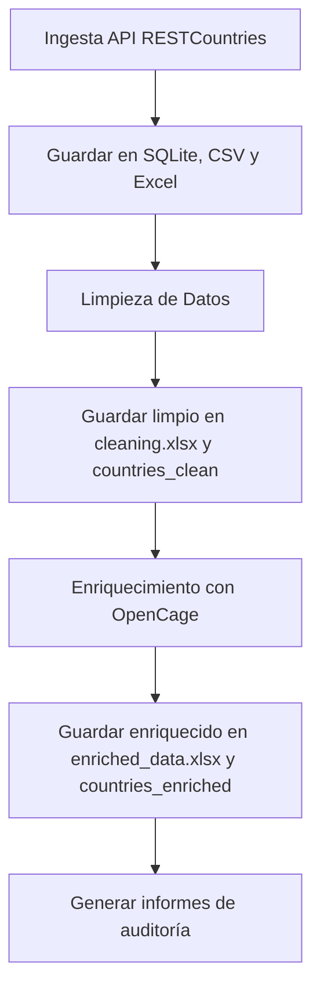

# 🌐 Proyecto de Ingesta, Limpieza y Enriquecimiento de Datos Globales

Este proyecto implementa una arquitectura de procesamiento de datos basada en Python, orientada al tratamiento de datos globales sobre países del mundo. Los datos son recolectados desde la API pública [RESTCountries](https://restcountries.com/v3.1/all) y enriquecidos con coordenadas geográficas utilizando la API de [OpenCage](https://opencagedata.com/).

---

<h1 align="center"><a href="https://juanesmedcol.github.io/bigdata-infrastructure/">Examina la Documentación del proyecto</a></h1>

---

## 🚀 Flujo de Trabajo



---

## 🧩 Componentes del Proyecto

| Script            | Descripción                                                                   |
| ----------------- | ------------------------------------------------------------------------------ |
| `ingestion.py`  | Solicita datos a la API de RESTCountries y los almacena en SQLite, Excel y CSV |
| `cleaning.py`   | Limpia datos (nulos, duplicados, tipos) y exporta a Excel y SQLite             |
| `enrichment.py` | Enriquecer con coordenadas geográficas usando la API de OpenCage              |
| `run.py`        | Ejecuta todo el flujo desde `src/` con control de estado                     |

---

## 📁 Estructura del Proyecto

```
.
│   .gitattributes
│   .gitignore
│   main.py
│   mkdocs.yml
│   README.md
│   requirements.txt
│   run.py
│   setup.py
│
├───.github
│   └───workflows
│           bigdata.yml
├───build
│   └───bdist.win-amd64
├───docs
│       cleaning.md
│       enrichment.md
│       index.md
│       ingestion.md
│       report.md
│       structure_db.md
└───src
    │   cleaning.py
    │   enrichment.py
    │   ingestion.py
    │   report.py
    └───static
        ├───auditoria
        │       cleaning_report.txt
        │       enriched_report.txt
        │       ingestion_report.txt
        ├───csv
        │       ingestion.csv
        ├───db
        │       ingestion.db
        └───xlsx
                cleaning.xlsx
                enriched_data.xlsx
                ingestion.xlsx
```

## 🛠️ **Requisitos**

Para ejecutar este proyecto, necesitas tener instalados los siguientes paquetes y herramientas:

* **Python 3.x**
* **SQLite3** (ya viene incluido con Python)
* Bibliotecas adicionales de Python que puedes instalar fácilmente usando `pip`

---

## 📥 **Instalación de las dependencias**

1. Clona el repositorio desde GitHub:

```bash
git clone https://github.com/JuanesMedCol/bigdata-infrastructure.git
```

2. Accede al directorio del proyecto:

```bash
cd bigdata-infrastructure
```

3. Instala las dependencias con cualquiera de las siguientes formas:

```bash
Opcion 1: pip install -r requirements.txt
Opcion 2: pip install .
```

---

## 📦 Archivos Generados

- `ingestion.xlsx`, `cleaning.xlsx`, `enriched_data.xlsx`
- `ingestion.db` con las tablas: `countries`, `countries_clean`, `countries_enriched`
- Archivos de auditoría detallando cada paso del proceso

---

## 💡 Créditos

- **RESTCountries API**: [https://restcountries.com](https://restcountries.com)
- **OpenCage API**: [https://opencagedata.com](https://opencagedata.com)
