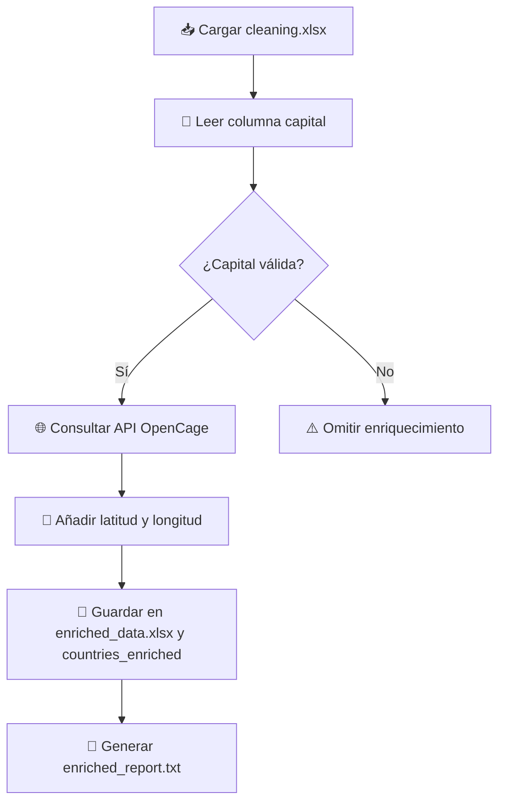
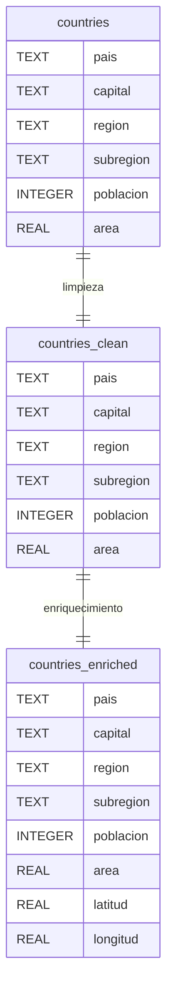

# Diagramas

1. **Ingesta**:

   - Se conecta a la API pública de RESTCountries.
   - Se guarda en SQLite (`countries`) y se exporta en formatos CSV y Excel.
   - Se genera un informe (`ingestion_report.txt`).
2. **Limpieza**:

   - Se eliminan duplicados.
   - Se imputan nulos y se corrigen tipos de datos.
   - Se almacena el resultado limpio en `countries_clean` y Excel.
3. **Enriquecimiento**:

   - Usa la API de OpenCage para obtener coordenadas por capital.
   - Añade columnas de latitud y longitud.
   - Se guarda como `countries_enriched` en SQLite y Excel.
4. **Flujo Secuencial**:

   - Cada fase depende de la anterior.
   - Los reportes permiten trazabilidad del estado de los datos.

=== "General"

```mermaid
flowchart TD
    A1[Consulta API RESTCountries] --> A2[Extraer datos]
    A2 --> A3[Guardar en SQLite: countries]
    A3 --> A4[Exportar a Excel y CSV]
    A4 --> A5[Generar reporte de auditoría]

    A5 --> B1[Leer countries desde SQLite]
    B1 --> B2[Eliminar duplicados]
    B2 --> B3[Imputar nulos (media / ffill)]
    B3 --> B4[Convertir tipos: población y área]
    B4 --> B5[Guardar en countries_clean y Excel]
    B5 --> B6[Generar cleaning_report.txt]

    B6 --> C1[Leer cleaning.xlsx]
    C1 --> C2[Extraer capitales]
    C2 --> C3{¿Capital válida?}
    C3 -- Sí --> C4[Consultar API OpenCage]
    C4 --> C5[Añadir latitud y longitud]
    C5 --> C6[Guardar en countries_enriched y Excel]
    C6 --> C7[Generar enriched_report.txt]
    C3 -- No --> CZ[Omitir registro]
```

=== "Ingesta"

```mermaid
flowchart TD
    A[Leer datos de tabla countries] --> B[Eliminar duplicados]
    B --> C[Imputar valores nulos (media, ffill)]
    C --> D[Convertir tipos: poblacion y area]
    D --> E[Guardar en cleaning.xlsx y countries_clean]
    E --> F[Generar cleaning_report.txt]

```

=== "Limpieza"

```mermaid
flowchart TD
    A[🔍 Leer datos de tabla countries] --> B[❌ Eliminar duplicados]
    B --> C[🧪 Imputar valores nulos (media, ffill)]
    C --> D[🔢 Convertir tipos: poblacion y area]
    D --> E[💾 Guardar en cleaning.xlsx y tabla countries_clean]
    E --> F[📝 Generar cleaning_report.txt]
```

=== "Enriquecimiento"



=== "Entidad-Relación"



=== "Resumen"

```mermaid
flowchart TD
    A[Ingesta desde API RESTCountries] --> B[Guardar en SQLite (countries) y Excel]
    B --> C[Limpieza de Datos (dropna, ffill, mean)]
    C --> D[Guardar limpio en cleaning.xlsx y countries_clean]
    D --> E[Enriquecimiento con coordenadas]
    E --> F[Guardar en enriched_data.xlsx y countries_enriched]

```
