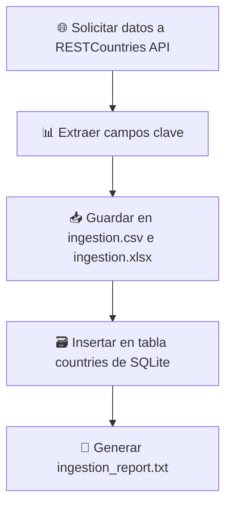
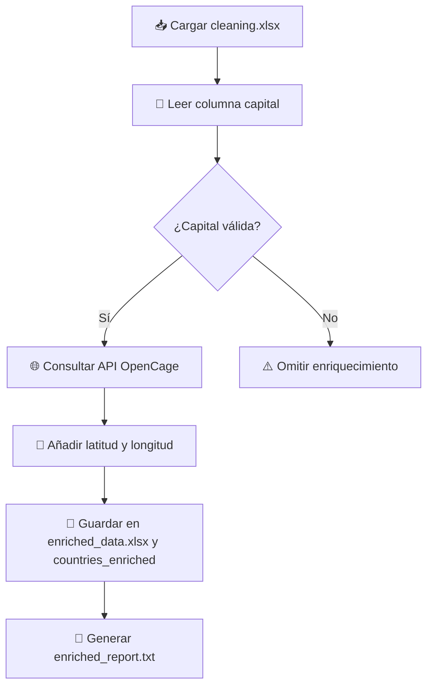
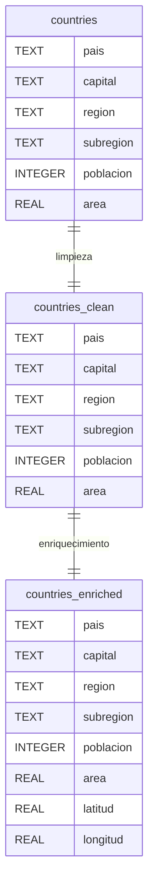

# Diagramas

1. **Ingesta**:
   - Se conecta a la API pública de RESTCountries.
   - Se guarda en SQLite (`countries`) y se exporta en formatos CSV y Excel.
   - Se genera un informe (`ingestion_report.txt`).

2. **Limpieza**:
   - Se eliminan duplicados.
   - Se imputan nulos y se corrigen tipos de datos.
   - Se almacena el resultado limpio en `countries_clean` y Excel.

3. **Enriquecimiento**:
   - Usa la API de OpenCage para obtener coordenadas por capital.
   - Añade columnas de latitud y longitud.
   - Se guarda como `countries_enriched` en SQLite y Excel.

4. **Flujo Secuencial**:
   - Cada fase depende de la anterior.
   - Los reportes permiten trazabilidad del estado de los datos.


=== "General"

``` mermaid
flowchart TD
    subgraph IN[🔹 Fase 1: Ingesta de Datos]
        A1[🌐 Consulta API RESTCountries]
        A2[📊 Extracción de atributos: país, capital, región, subregión, población, área]
        A3[🗃️ Guardar en tabla SQLite: countries]
        A4[📄 Exportar a Excel y CSV]
        A5[📝 Generar reporte de auditoría]
        A1 --> A2 --> A3 --> A4 --> A5
    end

    subgraph CL[🔹 Fase 2: Limpieza de Datos]
        B1[📥 Leer datos de tabla countries]
        B2[❌ Eliminar duplicados]
        B3[🧼 Imputar nulos (media para números, ffill para texto)]
        B4[🔢 Conversión de tipos: población y área]
        B5[💾 Guardar en tabla countries_clean y cleaning.xlsx]
        B6[📝 Generar cleaning_report.txt]
        B1 --> B2 --> B3 --> B4 --> B5 --> B6
    end

    subgraph EN[🔹 Fase 3: Enriquecimiento Geográfico]
        C1[📥 Leer cleaning.xlsx]
        C2[🔎 Extraer columna capital]
        C3{¿Capital válida?}
        C4[🌍 Consultar API OpenCage (1s por consulta)]
        C5[➕ Añadir latitud y longitud]
        C6[💾 Guardar en countries_enriched y enriched_data.xlsx]
        C7[📝 Generar enriched_report.txt]
        C3 -- Sí --> C4 --> C5 --> C6 --> C7
        C3 -- No --> Z[⚠️ Omitir registro]
        C1 --> C2 --> C3
    end

    IN --> CL --> EN
```

=== "Ingesta"



=== "Limpieza"

```mermaid
flowchart TD
    A[🔍 Leer datos de tabla countries] --> B[❌ Eliminar duplicados]
    B --> C[🧪 Imputar valores nulos (media, ffill)]
    C --> D[🔢 Convertir tipos: poblacion y area]
    D --> E[💾 Guardar en cleaning.xlsx y tabla countries_clean]
    E --> F[📝 Generar cleaning_report.txt]
```

=== "Enriquecimiento"



=== "Entidad-Relación"



=== "Resumen"

``` mermaid
flowchart TD
    A[🌍 Ingesta API RESTCountries] --> B[🗃️ Guardar en SQLite (countries) y Excel]
    B --> C[🧼 Limpieza de Datos (dropna, ffill, mean)]
    C --> D[🗃️ Guardar limpio en cleaning.xlsx y countries_clean]
    D --> E[🌍 Enriquecimiento con coordenadas]
    E --> F[🗃️ Guardar en enriched_data.xlsx y countries_enriched]
```