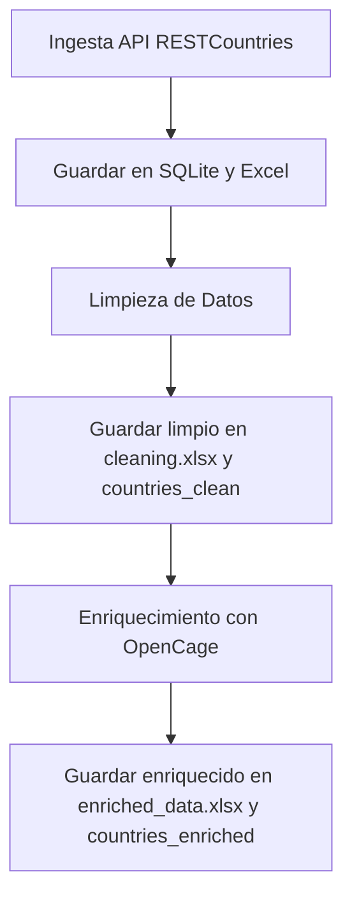

# 🌐 Proyecto de Ingesta, Limpieza y Enriquecimiento de Datos Globales

El proyecto integra tres fases principales en un entorno simulado de Big Data en la nube: **ingesta**, **limpieza** y **enriquecimiento** de datos. Utiliza `SQLite` como base de datos local simulando un almacén analítico, y `Python` como lenguaje principal para el procesamiento de datos. El flujo de trabajo se automatiza mediante `GitHub Actions` y se documenta con `MkDocs`.

---

<h1 align="center"><a href="https://github.com/JuanesMedCol/bigdata-infrastructure/">Examina el Repositorio del proyecto</a></h1>

---

## 🔥 **Funcionalidades:**

✅ Realiza una solicitud `GET` para obtener datos de todos los países del mundo.

✅ Almacena los datos en una base de datos SQLite.

✅ Exporta los datos a formatos **CSV** y **Excel** para su análisis.

✅ Limpia los datos, manejando valores nulos y datos duplicados.

✅ Enriquecer cada país con su latitud y longitud usando la API de OpenCage.

✅ Genera informes de auditoría detallados con el estado de cada proceso.

---

## 📂 **Estructura del Proyecto**

[**Repositorio del Proyecto**](https://github.com/JuanesMedCol/bigdata-infrastructure/)

```
[bigdata-infrastructure]
│   README.md
│   requirements.txt
│   run.py
│
├───docs
│       index.md
│       ingesta.md
│       limpieza.md
│       enrichment.md
│
└───src
    │   ingestion.py
    │   cleaning.py
    │   enrichment.py
    │
    └───static
        ├───auditoria
        │       ingestion_report.txt
        │       cleaning_report.txt
        │       enriched_report.txt
        ├───csv
        │       ingestion.csv
        ├───db
        │       ingestion.db
        └───xlsx
                ingestion.xlsx
                cleaning.xlsx
                enriched_data.xlsx
```

---

## 🛠️ **Requisitos**

Para ejecutar este proyecto necesitas tener instalado:

* **Python 3.x**
* **SQLite3**
* Bibliotecas de Python (ver `requirements.txt`) que incluyen:
  - `pandas`
  - `requests`
  - `openpyxl`
  - `tqdm`

---

## 🚀 **Ejecución del Proyecto**

Este script ejecuta en orden toda la rutina del programa:

```bash
python run.py
```

---

## 📊 Modelo de Base de Datos

### 🧩 Estructura de las tablas

#### Tabla `countries`

Contiene la información original obtenida desde la API.

#### Tabla `countries_clean`

Contiene los datos luego de ser limpiados.

#### Tabla `countries_enriched`

Contiene los datos enriquecidos con latitud y longitud.

```sql
CREATE TABLE IF NOT EXISTS countries (
    pais TEXT,
    capital TEXT,
    region TEXT,
    subregion TEXT,
    poblacion INTEGER,
    area REAL
)
```

---

## 🧠 Diagrama Mermaid – Flujo General


