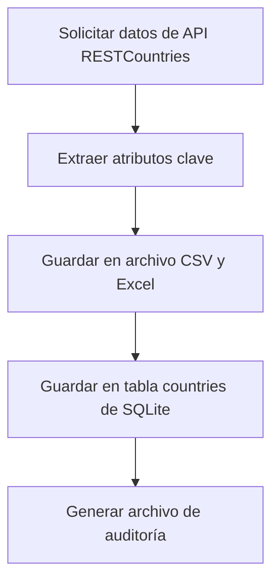

## 🌍 Ingesta de Datos desde API Pública

Este módulo permite la recolección de datos desde la API [RESTCountries](https://restcountries.com/v3.1/all), que proporciona información detallada de todos los países del mundo.

---

### 🧠 ¿Qué hace este script?

✅ Realiza una solicitud HTTP GET a la API `https://restcountries.com/v3.1/all`.

✅ Extrae los siguientes campos para cada país:
- Nombre común (`pais`)
- Capital
- Región
- Subregión
- Población
- Área

✅ Guarda los datos en:
- **Base de datos SQLite** (tabla `countries`)
- **Archivo CSV** (`ingestion.csv`)
- **Archivo Excel** (`ingestion.xlsx`)

✅ Genera un informe de auditoría (`ingestion_report.txt`) con la cantidad total de países extraídos y las columnas incluidas.

---

### 📁 Archivos Generados

* `src/static/csv/ingestion.csv`
* `src/static/xlsx/ingestion.xlsx`
* `src/static/db/ingestion.db`
* `src/static/auditoria/ingestion_report.txt`

---

### 📋 Estructura de la Tabla `countries`

```sql
CREATE TABLE countries (
    pais TEXT,
    capital TEXT,
    region TEXT,
    subregion TEXT,
    poblacion INTEGER,
    area REAL
);
```

---

### 📝 Ejemplo de Fila

| pais        | capital    | region    | subregion      | poblacion  | area    |
|-------------|------------|-----------|----------------|------------|---------|
| Colombia    | Bogotá     | Americas  | South America  | 50882884   | 1141748 |

---

### 🧪 Diagrama Mermaid – Flujo de Ingesta



---

### ✅ Resultado

Una vez finalizada la ingesta, los datos están disponibles para el siguiente paso: limpieza.