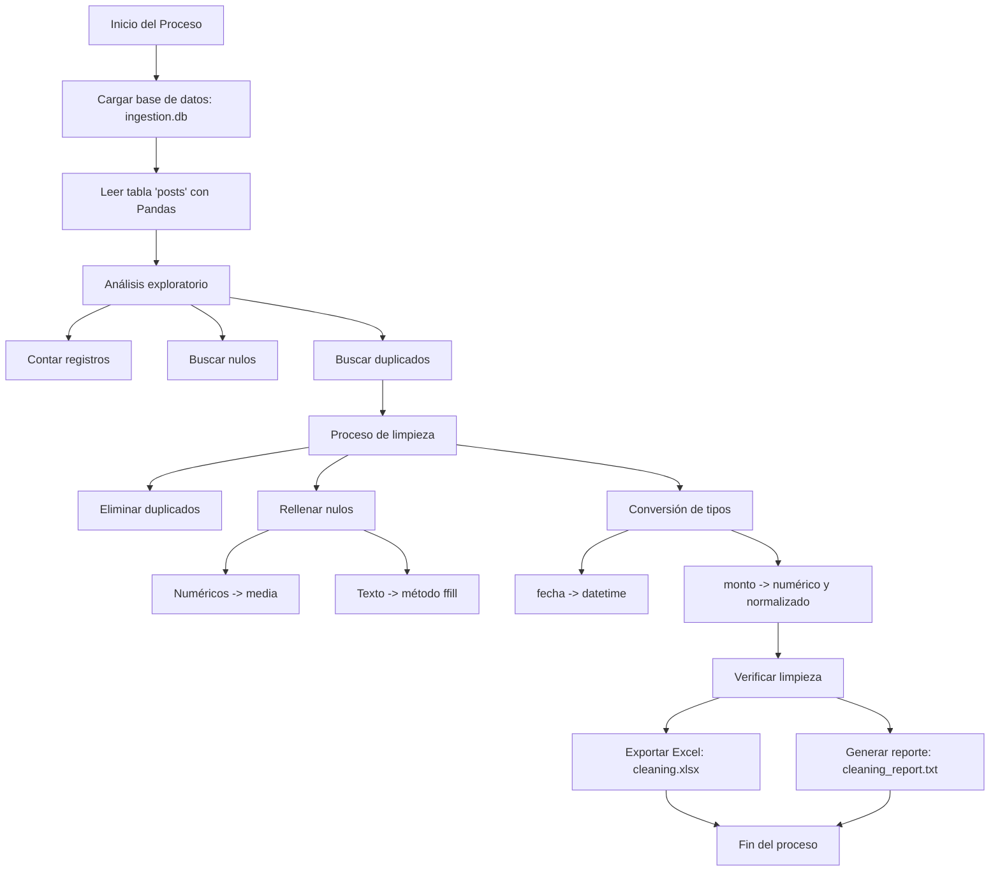

## 🧼 Limpieza y Transformación de Datos

Este script realiza una limpieza automática de datos almacenados en una base de datos SQLite. A continuación, se detalla cada una de las etapas del proceso.

---

### 📁 Estructura de Archivos

* **Base de datos de entrada** : `src/static/db/ingestion.db`
* **Archivo Excel de salida** : `src/static/xlsx/cleaning.xlsx`
* **Reporte de auditoría** : `src/static/auditoria/cleaning_report.txt`

---

### 🔹 1. Carga de Datos

Se conecta a la base de datos SQLite y se lee la tabla `posts`.

```python
def load_data():
    conn = sqlite3.connect(DB_PATH)
    query = "SELECT * FROM posts"
    df = pd.read_sql_query(query, conn)
```

---

### 🔍 2. Análisis Exploratorio

Se genera un pequeño resumen con:

* Número total de registros
* Cantidad de valores nulos por columna
* Registros duplicados

```python
def explore_data(df):
    df.isnull().sum()
    df.duplicated().sum()
```

---

### 🧼 3. Proceso de Limpieza

La limpieza incluye:

* ✅ Eliminación de duplicados
* ✅ Relleno de valores nulos:
  * Numéricos → con la media
  * Texto → con el valor anterior (`ffill`)
* ✅ Conversión de tipos:
  * `fecha` → datetime
  * `monto` → numérico
  * Normalización de `monto` (media 0, desviación estándar 1)

```python
df = df.drop_duplicates()
df[col] = df[col].fillna(df[col].mean())  # para columnas numéricas
df[col] = df[col].ffill()                 # para texto
```

---

### 💾 4. Guardado de Resultados

Se exportan los datos a:

* Archivo **Excel** (`.xlsx`)
* Un **reporte de limpieza** en `.txt`, que incluye resumen del análisis y total de registros finales

```python
df.to_excel(OUTPUT_CSV, index=False)
with open(AUDIT_FILE, "w", encoding="utf-8") as f:
    f.write(...)
```

---

### 📊 Reporte generado

**Ejemplo de contenido del `cleaning_report.txt`:**

```
📋 Informe de Limpieza de Datos

Número total de registros: 100
Número de valores nulos por columna:
id       0
title    0
body     0
...
Número de registros duplicados: 2

✅ Número de registros después de limpieza: 98
```

---

### ✅ Resultado Final

El script completa el proceso con logs informativos:

```
🚀 Inicio del proceso de limpieza de datos
📥 Datos cargados correctamente...
✅ Proceso completado con éxito.
```

---

### 📎 Archivos Generados

* [Excel de Limpieza](resultados/cleaning.xlsx)
* [Reporte de Auditoria](resultados/cleaning_report.txt)

---

### 🧠 Diagrama del Flujo de Limpieza


